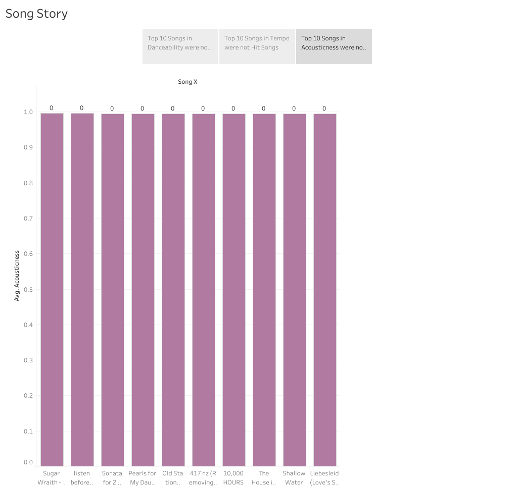
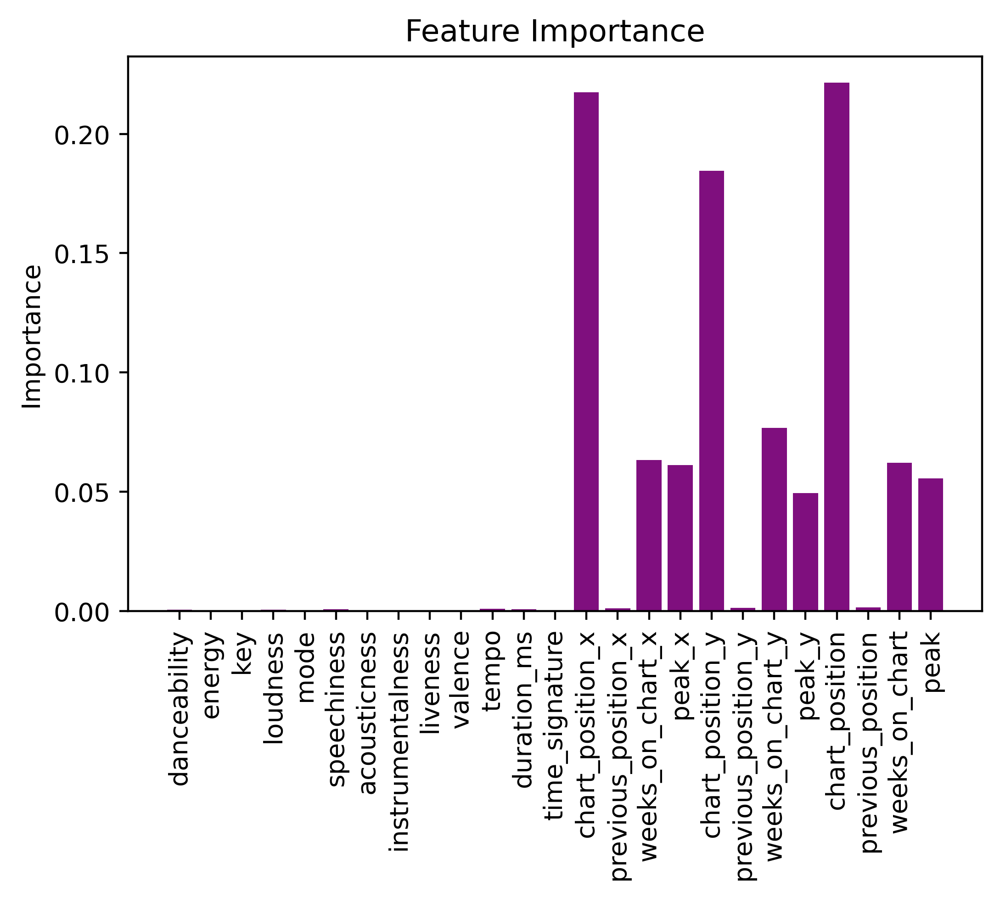
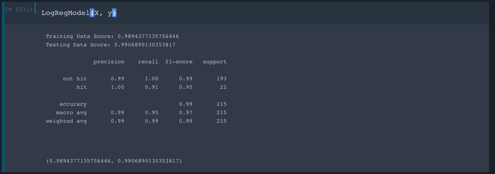
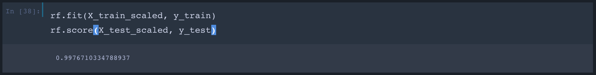
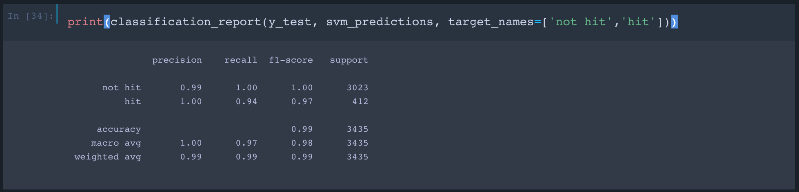
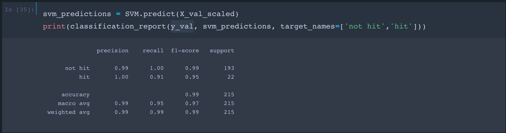

# song-reccomendations

Billboard Charts Machine Learning Project
Team Members: Sarah D. Hood, Jini Hassan, Ryan Eccleston-Murdock, Wasif Khan, Angeli Lucila, Ivana Korak

# Datasets we used: 

## 1. Top Songs 2015-2019 dataset: 
https://www.kaggle.com/leonardopena/top-spotify-songs-from-20102019-by-year 

Context: The top songs BY YEAR in the world by spotify. This dataset has several variables about the songs and is based on Billboard
Content: There are the most popular songs in the world by year and 13 variables to be explored. Data were extracted from: http://organizeyourmusic.playlistmachinery.com/

Attributes Measured:

* ***Top Song:*** whether the song is on the Billboard Top 100 for that week (1 - Yes, 0 - No)
* ***Popularity/pop:*** how popular a song is. The higher the number, the more popular it is.
* ***Speechiness/spch:*** how much spoken word is in the track.
* ***Acoustic-ness/acous:*** how acoustic the song is.
* ***Duration/dur:*** how long the track is (in seconds).
* ***Valence/val:*** how positive the track is.
* ***Liveness/live:*** how likely it is for the track to be a live recording.
* ***Decibels/dB:*** how loud the track is.
* ***Danceability/dnce:*** how easy it is to dance to the song.
* ***Energy/nrgy:*** how energetic the song is.
* ***Beats Per Minute/bpm:*** how many beats per minute, or, the track’s tempo.

## 2. Top Songs 2020 dataset:
https://www.billboard.com/charts/year-end/2020/hot-100-songs

Context: Year-End Hot 100 Songs

## 3. Spotify Songs and Attributes: 
https://www.kaggle.com/yamaerenay/spotify-dataset-19212020-160k-tracks?select=artists.csv

Context: 

# Summary & Motivation: 

We were inspired to continue working with the music industry in general and related datasets, and include suitable machine learning models, such as logistic regression and SVM to draw connections between song attributes of ‘Hit’ and ‘Non-Hit’ to predict future weekly billboard top 100 songs.

We used the top songs 2020 dataset in combination with scraping of the top 100 weekly Billboard lists, and  calls to the Spotify API to compile a CSV containing both ‘Hit’ and ‘Non-Hit’ songs between 2018 and 2021. We will train this dataset using machine learning models to predict the top genre(s) and artist(s) likely to appear in the weekly Billboard top 100 for 2021. 

We identified individual song characteristics (for example, how long a song has been on the chart, its peak position, etc.) and used these defining attributes of ‘Hit’ songs to forecast the following week’s top 100 Billboard songs. 

# Initial Hypothesis & Learnings

Continuing off our [last project](https://github.com/reccleston/music-project) , our initial assumption was that the attributes of the songs directly correlated with the popularity of the song, and essentially, whether that song would be on the Billboard chart. These attributes are listed above. However from our [initial analysis in Tableau](angeli/SongStory.twbx), we saw that many of the top songs that had a high danceability value were not classified as “hit songs.” This showed us that the attributes did not correlate to popularity as we initially hypothesized - we confirmed this by running a Logistic Regression, Support Vector Machine (SVM), and Random Forest Classifier to show the importance of each feature, pictured below:

*Fig. 1: Top Songs Barchart showed that Top Danceable Songs were not Hits*

*Fig. 2: Feature Importance Barchart showed stronger importance in Billboard Attributes*

This led us to pivot our inputs for our machine learning models to include more insightful information like the attributes listed in the [Billboard dataset](BB_Final.csv). Some examples of these new attributes are:
Chart position of test data
Previous position of test data
Numbers of weeks on the billboard chart
Peak position on the billboard chart

# Classification Models Used:
* Logistic Classification
* Support Vector Machine (SVM)
* Random Forest Classifer

# Key Takewaways

*Fig. 3: Logistic Regression Model*

*Fig. 4: Random Forest Classifier*

*Fig. 5 & 6: Support Vector Model*

# Folders Directory:
* [Wasif Folder](https://github.com/reccleston/song-recomendations/tree/main/wasif)
* [Angeli folder](https://github.com/reccleston/song-recomendations/tree/main/angeli) 
* [Jini folder](https://github.com/reccleston/song-recomendations/tree/main/jini)
* [Ryan folder](https://github.com/reccleston/song-recomendations/tree/main/ryan/data)
* [Sarah folder](https://github.com/reccleston/song-recomendations/tree/main/sarah) 
* [Ivana folder](https://github.com/reccleston/song-recomendations/tree/main/ivana)

